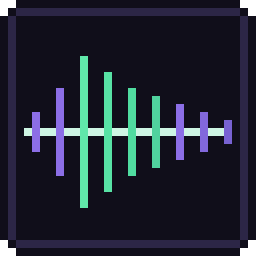
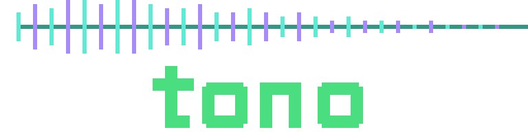
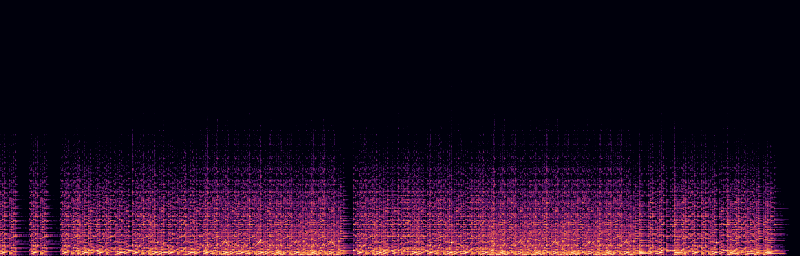
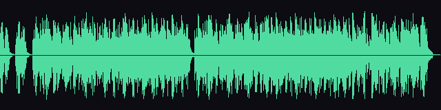
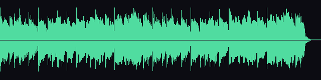

<p align="center">
  
</p>
<p align="center">
  
</p>

<p align="center"><strong>A headless sound studio for AI agents — GarageBand-as-API, over MCP.</strong></p>

<p align="center">
  <a href="https://github.com/marmikshah/sonarium/actions/workflows/ci.yml"></a>
  <a href="https://github.com/marmikshah/sonarium/releases/latest"></a>
  
</p>

<p align="center">
  <a href="https://marmikshah.github.io/sonarium/listen.html"><strong>▶ Listen to everything in your browser</strong></a>
  &nbsp;·&nbsp;
  <a href="https://marmikshah.github.io/sonarium/playground/"><strong>✎ Design a sound live (WASM playground)</strong></a>
</p>

<p align="center">
  
</p>
<p align="center">
  
  
</p>

<p align="center"><em>Every sound behind these images — a complete piano piece,
a four-instrument band, three game-ready BGM loops — was composed, mixed and mastered by
agents through the MCP tools, and every one replays byte-identically from a
session file in this repo. The logo and wordmark were drawn by an agent with
<a href="https://github.com/marmikshah/atelier">atelier</a>, sonarium's
pixel-art sibling.</em></p>

## What it is

Agents are good at *describing* sound and bad at *hearing* it. sonarium closes
the loop: every synth, instrument, and mixer move is a tool call, and every
render hands back analysis — levels, loudness, spectral centroid, transients —
plus a **spectrogram and a waveform image** the agent can actually look at,
judge, and correct. The same listen-and-fix loop a human runs in a DAW. One
Rust binary; no API keys, no network, fully deterministic.

- **A real studio, headless** — a polyphonic sequencer with a core instrument
  set (piano, e-piano, organ, strings, bass, a GM-mapped drum kit, pitched
  cowbell, plucked string, FM mallets) plus raw band-limited oscillators, FM,
  supersaw and three noise colours for synthesis and SFX.
- **Real recorded instruments** — the `sampler` voice plays any SoundFont
  (point it at a free GM bank): sampled grands, basses, string ensembles, GM
  drums. Renders stay deterministic.
- **A mixing console** — per-track pan/gain onto a true stereo bus, a master
  processor chain, decorrelated reverb tails, sidechain ducking, swing and
  humanize groove.
- **An ear for critique** — peak/true-peak/RMS/crest, ≈LUFS, spectral
  centroid, attack/decay/onset/silence descriptors, `compare_sounds` deltas:
  "does it sound right?" becomes numbers an agent can act on.
- **Deterministic, replayable music** — a session file is the ordered journal
  of tool calls; replaying it reproduces the project **byte-for-byte**.
  Annotated example recipes double as tutorials and CI tests.
- **Game-ready output** — WAV/FLAC/OGG, seamless loops with `smpl` chunks,
  loudness-matched packs with `sounds.json` manifests, and engine files for
  Godot / Unity / Bevy.

The full tool surface (30 tools) is documented in [docs/TOOLS.md](docs/TOOLS.md).

## Quickstart

```sh
curl -fsSL https://marmikshah.github.io/sonarium/install.sh | sh
```

The installer sets sonarium up as stdio (your MCP client spawns it) or as a
shared background HTTP daemon, and prints the matching registration line —
e.g. `claude mcp add --scope user sonarium -- sonarium`. Re-run it to update,
or append `-s -- uninstall` to remove.

Prebuilt binaries cover macOS (Apple Silicon), Linux x86_64 and Windows
(grab the `.zip` from [releases](https://github.com/marmikshah/sonarium/releases/latest));
anything else builds from source with `cargo install --path .`.

Restart your session (MCP tools load at session start), then ask your agent
for sound — *"make me a punchy laser zap"*, *"write a 30-second battle
theme"*. The agent drives the loop:

```
author_sound → analyze (look!) → set_param / edit_sound → export
```

Sounds live under `~/.sonarium/sounds` (override with `SONARIUM_WORKDIR` —
point it at your game's assets folder to drop renders straight in).

### Server modes

```sh
sonarium                        # stdio MCP server (default — the client spawns it)
sonarium --http 127.0.0.1:8787  # streamable HTTP at /mcp
make daemon                     # background HTTP server via launchd / systemd --user
```

### Real instruments

The synth instruments need nothing. For sampled ones, download any free
General MIDI SoundFont once (FluidR3 GM, GeneralUser GS) and point the seq at
it: `wave: "sampler", sf2: "/path/to/gm.sf2", sf2_preset: 0` (0 grand piano,
32 bass, 48 strings; `sf2_bank: 128` = the GM drum map).

## Sessions: deterministic, replayable music

Every mutating tool call is journaled, so a piece of music is a **session
file** — JSON that replays identically every time:

```sh
sonarium replay docs/examples/band-demo.json --workdir /tmp/sonarium-demo
```

Eleven annotated examples live in [docs/examples/](docs/examples/), every one
replayed in CI. The deep cuts: the canonical SFX workflow (laser → variants →
bank), a four-instrument band on the mixing console, the complete *River
Flows in You* on the piano instrument (800 notes converted from MIDI with
rubato and sustain pedal intact —
[docs/examples/midi_to_seq.py](docs/examples/midi_to_seq.py) converts any
MIDI), and three loop-ready game BGM tracks — a soft evening theme, a
driving boss battle (kick-ducked bass riff, phrygian sawtooth lead), and a
swung idle-platformer bounce.

And an **iconic-sounds pack** — recognizable classics rebuilt from scratch,
with playable renders in [docs/examples/audio/](docs/examples/audio/):

| Recipe | Play | The trick |
|---|---|---|
| [retro-coin](docs/examples/retro-coin.json) | [▶ mp4](docs/examples/audio/retro-coin.mp4) | B5 grace note into a held E6 — the interval *is* the sound |
| [jump-8bit](docs/examples/jump-8bit.json) | [▶ mp4](docs/examples/audio/jump-8bit.mp4) | exponential square sweep, gone at sustain 0 |
| [waka](docs/examples/waka.json) | [▶ mp4](docs/examples/audio/waka.mp4) | per-note pitch slides alternating up/down — the chomp drawn into the note list |
| [nokia-tune](docs/examples/nokia-tune.json) | [▶ mp4](docs/examples/audio/nokia-tune.mp4) | 13 notes of Gran Vals on the Karplus-Strong pluck |
| [deep-note](docs/examples/deep-note.json) | [▶ mp4](docs/examples/audio/deep-note.mp4) | 8 supersaw mixer tracks gliding from a scattered cluster onto a five-octave D chord |

The ▶ links play right on GitHub (each mp4 is the sound's spectrogram with
the audio as its track — click, press play). The
[listen page](https://marmikshah.github.io/sonarium/listen.html) plays every
showcase inline, including the full piano piece and the three BGM loops.
OGGs sit next to the mp4s for direct use.

## Works with atelier

sonarium is the audio half of a pair:
[**atelier**](https://github.com/marmikshah/atelier) is the same idea for
pixel art — a headless Aseprite-as-API over MCP. Side by side, one agent
session produces a game's art *and* audio: atelier draws the sprites, tiles
and animations; sonarium scores the SFX, ambience and music; both export
engine-ready packs with manifests, and both record replayable recipes.

## More

- [docs/TOOLS.md](docs/TOOLS.md) — the complete MCP tool reference.
- [docs/cookbook.md](docs/cookbook.md) — the DSL, the instrument table, and
  worked recipes (also served to agents as the `sonarium://cookbook` resource;
  every example in it is validated by the test suite).
- [ROADMAP.md](ROADMAP.md) — the backlog.
- `make help` — build/serve/test targets; `make check` is the pre-commit gate.

## License

Dual-licensed under [MIT](LICENSE-MIT) or [Apache-2.0](LICENSE-APACHE), at
your option.
